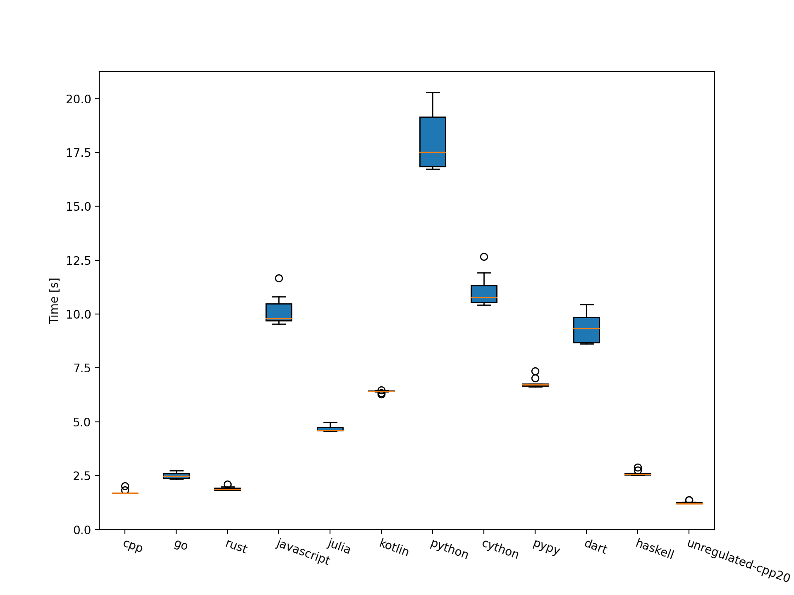

# langs-bench-dijkstra
Simple benchmarks of Dijkstra algorithm in 3,000,000 edged graph network. 

Written in C++, Go, Julia, Python(+Cython +PyPy), JavaScript(Node), Rust, Dart, Haskell and Kotlin.



# Motivation

I made this benchmark to estimate the performance improvement of rewriting the code. Especially wanted to know 'How much (generally) Golang is faster than Python?'.

More background is noted in [this Japanese article](https://qiita.com/reki2000/items/55ef54b96b26d80ad694)

# Regulation

This benchmark focuses each languages' "naive" perfomance, in other words "How much it would be faster if I rewrite this code written in language A to the language B?". 

Each language's implementation should have no change/improvement in point of view for data structure and algorithm of the original.

Each benchmark follow the regulation below:
- only use the language's standard library for data manipulation. (some exception may be allowed)
- use only one thread. language-provided threads like a garbage collector are out of this regulation.
- load the CSV of  `_,_,Start-NodeId,End-NodeId,_,Distance` from stdin, then constructs a directed graph network in the memory.
- execute Dijkstra's shortest path search with given times N
  - N-th search starts from the N * 1000th node and searches whole the road network, then shows the route to the 1st node. 

## Command Line Interface

- `make` builds executable for `bench.sh`
- `./bench.sh N` runs this benchmark N times
- `./bench.sh 1 debug` should make the identical debug output with the reference implementation(golang)'s 

## Internal Graph Network Structure
Constructed graph network should provide these interfaces with O(1) implementation:
- index(NodeId): NodeIndex of the given NodeId, where NodeIndex is sequencially numbered when new NodeId occurs
- id(NodeIndex): the original NodeId for given NodeIndex
- edges(NodeIndex): short list of Edges which starts with given NodeIndex
  - each Edge should provide:
    - index: NodeIndex of the opposite node
    - distance: its Distance as Int. the value is the x100 of the truncate to the 2nd decimal point of the loaded CSV'sdistance value.
- size: number of nodes (= the max of NodeIndex) in the graph network

## Other Notes
- a distance in CSV as 0.019999999999999999 should be parsed to 1. not 2, from 0.02 * 100

# Setup

## Tools

This benchmark uses [hyperfine](https://github.com/sharkdp/hyperfine). Follow the install instruction there.


For `cpp` and `unregulated-cpp20` , submodules are contained. You need to

```
git submodule update --init --recursive
```

 at first.

To plot the benchmark results, you need matplotlib module.

```
pip install numpy matplotlib
```

## Language Environments

You need running environments for languages below:
- Go : 1.18
- Rust : 1.62
- JavaScript : NodeJS 18, bun 1.0.1
- Kotlin : 1.7 + jdk >= 18
- Julia : 1.7
- Clang : 7 (or versions which support C++17)
- GCC(g++) : 10 (or versions which support C++20)
- Dart : 2.16.1
- Python : 3.10, Cython 0.29, PyPy 3.9-7.3.9
- Haskell: GHC 9.2.4 ,[some libs like GMP](https://github.com/haskell/ghcup/tree/master/.requirements/ghc)

I like using [asdf](https://asdf-vm.com/#/) to set up those environments, except Clang and Haskell.

```sh
while read lang plugin dummy; do
  asdf plugin add $plugin
  (cd $lang; asdf install)
done <<EOT
go golang
python python
cython python
pypy python
kotlin java
kotlin kotlin
rust rust
julia julia
javascript nodejs
js-bun bun
dart dart
EOT
asdf reshim
```

for Haskell, prepare `ghc` and `cabal` by using [ghcup](https://www.haskell.org/ghcup/).

```sh
# for ubuntu
sudo apt install build-essential curl libgmp-dev libffi-dev libncurses-dev libtinfo5
curl https://gitlab.haskell.org/haskell/ghcup/raw/master/bootstrap-haskell -sSf | sh
. "$HOME/.ghcup/env"
echo '. $HOME/.ghcup/env' >> "$HOME/.bashrc" # or similar

ghcup install ghc 9.2.4 --set 
ghcup install cabal 3.8.1.0 --set 
```

## Road Network Data

you need to get the Tokyo's road network data from [Urban Road Network Data](https://figshare.com/articles/Urban_Road_Network_Data/2061897) .
```sh
mkdir data
curl -L https://ndownloader.figshare.com/files/3663336 > data/tokyo.zip
pushd data
unzip tokyo.zip
popd
```

# How to run

for all languages
```sh
./run.sh
```

for specific language
```sh
./run.sh [cpp|go|rust|javascript|js-bun|julia|kotlin|python|cython|pypy|dart|haskell|unregulated-cpp20]
```

for test setup - choose one implementation (ex.`go`) to make a 'correct' result.
```
mkdir out
./test.sh cpp
mv out/cpp.txt out/expected.txt
```

for test
```
./test.sh [cpp|go|rust|javascript|js-bun|julia|kotlin|python|cython|pypy|dart|haskell|unregulated-cpp20]
```
